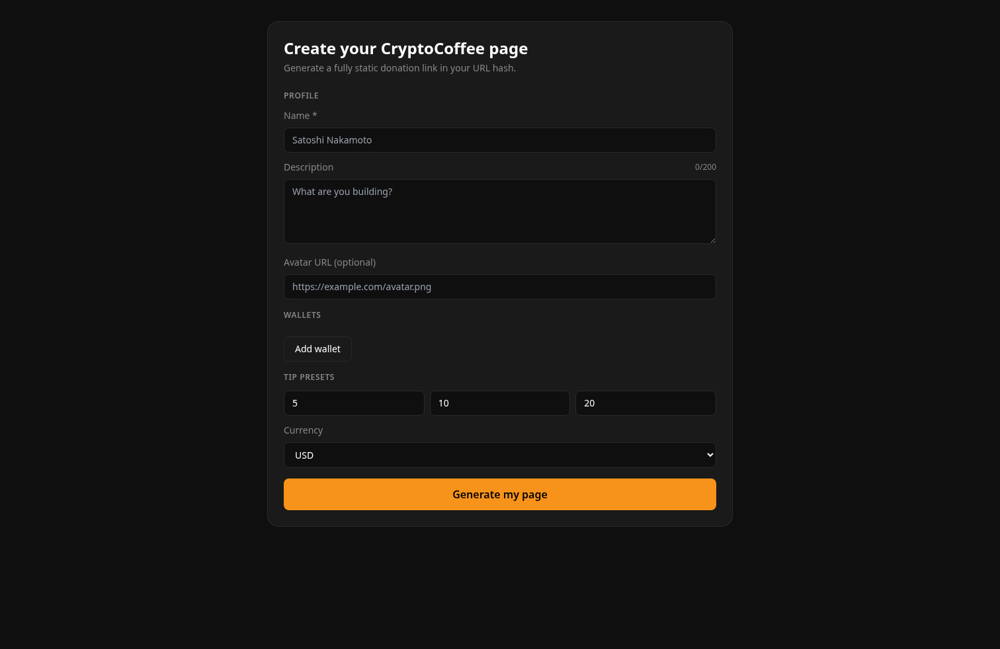
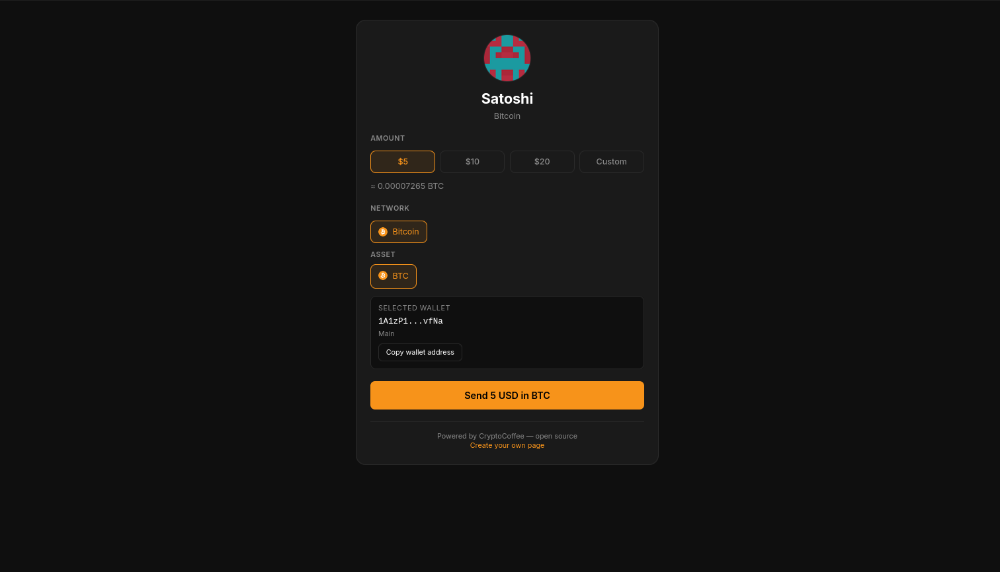

# CryptoCoffee

> Open-source, fully static crypto tipping app.  
> No backend. No database. All profile data lives in the URL hash.


CryptoCoffee is an open-source alternative to Buy Me a Coffee for crypto donations.  
Creators generate a shareable `/tip#...` link, and supporters pay using wallet extension, deep link, or QR code.

## Demo

- Live demo: `https://your-domain.example` (replace with your deployed URL)

## Screenshots

### Constructor



### Tip Page



## How It Works

1. Creator opens `/` and configures profile, wallets, and tip presets.
2. App serializes config as JSON and encodes it into Base64 URL hash.
3. Creator shares a link like `/tip#eyJ...`.
4. Donor opens the link, selects amount/network/asset, and sends payment.
5. App builds payment URI and uses extension/deep link/QR flow.

All state is client-side and embedded in hash payload.

## Local Development

```bash
npm install
npm run dev
```

Production build:

```bash
npm run build
npm run preview
```

## Create Your Tip Page

1. Open `https://your-domain.example`.
2. Fill profile and wallets in constructor.
3. Click `Generate my page`.
4. Copy generated `/tip#...` link.
5. Open `Preview my page` to test.

## Security / Privacy Notes

- No backend and no custody.
- Config data in URL hash is visible to anyone with the link.
- Debug logging is development-only.

## Contributing

See [CONTRIBUTING.md](./CONTRIBUTING.md).

## License

MIT — see [LICENSE](./LICENSE).
